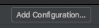
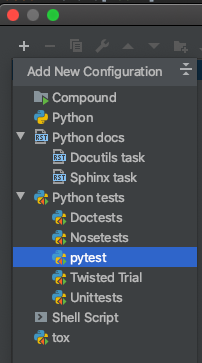
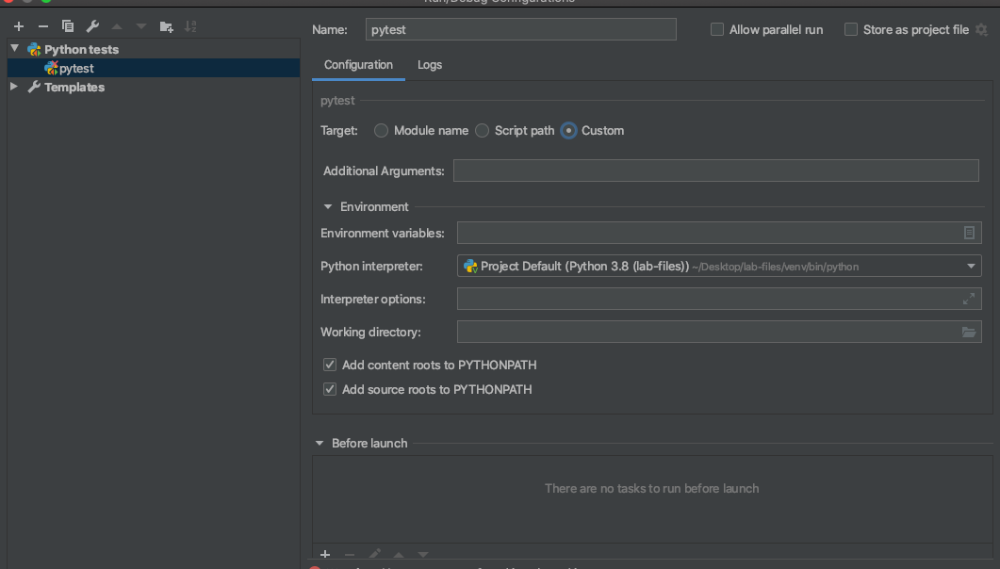
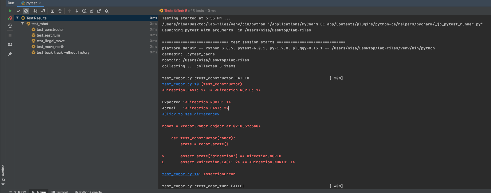
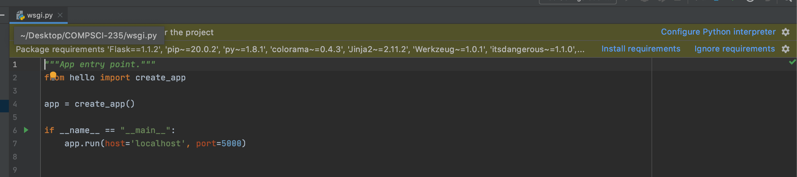
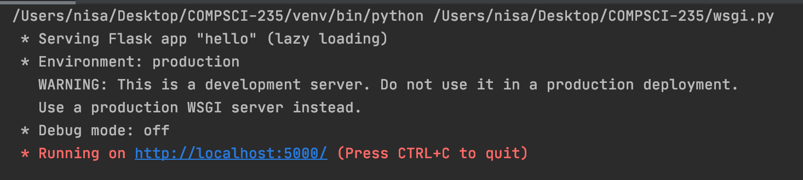
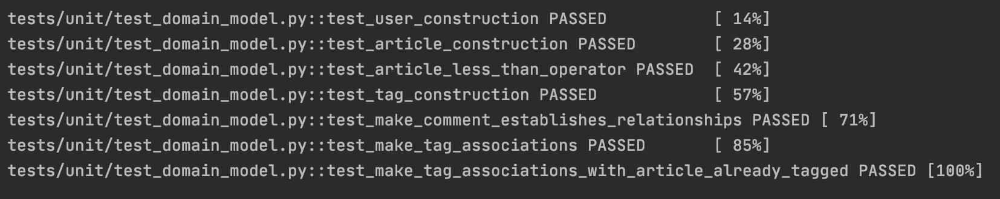

# Lab 3 (COMPSCI 235)

## Learning Intentions

- Build, run and use a simple Flask Web app.
- Work with `pytest` to implement unit tests and debug code.

## Lab Tasks

### Task 1

- Create a new Python project with a Virtual Environment of your choice (`venv` or `conda`) like we did in Lab One
- Download `robot.py` and `test_robot.py` files from Canvas and place it into your project
- Install the `pytest` package (PyCharm should say to install it)
- Add a new `pytest` configuration on PyCharm
  - Click on the `Add Configuration` button (top right of PyCharm)
    - 
  - Click on the '+' button > Python tests > `pytest` > Ensure "custom" is selected on the target menu > Ok
    - 
    - 
  - You should now be able to run the configuration by pressing the run button
  - Tests should run (all tests should FAIL)
  - You should see this 
- Understand the 5 tests and what they do (The tests are all written correctly)
- Fix the bugs in `robot.py` so it passes all the current tests
- After you have fixed all the bugs in `robot.py` implement the remaining tests
- These are the tests you will be implementing:
  - Testing the `turn()` method (Make 3 test cases, 1 already is made for east turn)
    - Test the direction for all the remaining directions the Robot can turn
  - Testing the `move()` method (Make 6 Test cases (3 for each valid, invalid moves))
    - Test for a valid move in each direction the `Robot` is facing (1 has already been made)
    - Test for an invalid movie (i.e. an attempt to move outside of the 2D grid) in each direction the `Robot` is facing (1 has already been made)
  - Testing the `backtrack()` method (4 Test Cases)
    - One test has already been written (backtracking when no history)
    - Test backtracking after making a move
    - Test backtracking after making a turn
    - Test backtracking once after making multiple moves
    - Test backtracking all the multiple moves after making multiple moves
- Reflect upon these tests, why is writing tests important? How does it help our code? Write this in your journal.
- Push this code on your Github so we can check

### Task 2

- Fork the repository from Ian's branch (like we did in the last lab): [https://github.com/ian-warren/COMPSCI-235](https://github.com/ian-warren/COMPSCI-235)
- Clone this repository onto your machine
- There are 3 branches in this repository (Understand what branches in `Git` are)
  - `01_hello_flask`
  - `02_COVID_domain_model`
  - `03_COVID_repository`
- For this task we want to use the switch to the `01_hello_flask` branch, to do this type this command in terminal: `git checkout 01_hello_flask`
- We will open this folder (`COMPSCI-235`) up in PyCharm (Do _not_ create a new project)
- Open up the `wsgi.py` file 
- Configure the Python interpreter by creating a new virtual environment and then install the requirements from `requirements.txt`
- Once this is done, right click on `wsgi.py` and click on "Run 'wsgi'"
- If this is successful then you should see 
- Go to [http://localhost:5000](http://localhost:5000) and you should see a page with the text "Index page"
- Go to the Hello folder on PyCharm and you see there are more handler functions for the different routes. Play around with them and see what can be seen on the browser.
- Make a new handler function called `greeting` which accepts a query parameter for a name. This function should return a HTML string which greets that name (i.e. Kia Ora Terry!).
  - Hint: The end result should be that when a user goes to `http://localhost:5000/greeting?name=Bob` a web page should be returned with HTML that says "Kia Ora Bob" (or whatever greeting you want to give them)
- Once this is done and you're sure this works, add, commit and push this new code to your Github account so we can check that the function you've made works. (Note that you will be pushing to the `01_hello_flask` _not_ the Master branch)
- Link this repository in your journal.

### Task 3

- For this task we will be using the `02_COVID_domain_model`. To switch to this branch use the command: `git checkout 02_COVID_domain_model`
- Open up this project in PyCharm like before
- The virtual environment from Task 2 should still be there. If it isn't create one.
- Install the requirements.txt file
- Try creating a new `pytest` configuration (Similar to Task 1 for the Robot tests)
- Run this `pytest` configuration and ensure that you can see all the tests pass 
- Go through the `/covid/domain/model.py` file and understand how the classes are made.
- Explore and understand what type hints are in Python. Explain briefly with some examples in your journal.
- Explore and understand what the `@property` decorator does in Python. Explain briefly with some examples in your journal.

### Useful Resources:

- [Python Unit Testing With Pytest](https://www.youtube.com/watch?v=2sb5JJLpzw8)
